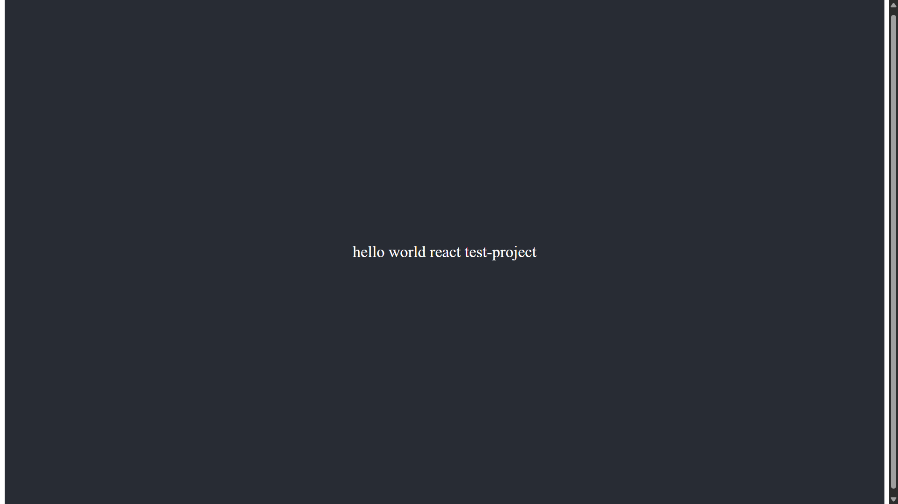

# Hello World React Project

This is a simple React application that displays "Hello, World!" on the page.

## Screenshot



## How to Run

1. Install dependencies:
   ```bash
   npm install
   ```
2. Start the development server:
   ```bash
   npm start
   ```

The app will open at http://localhost:3000

## Project Structure

- `src/App.js` - Main React component
- `public/index.html` - HTML template
- `src/hello-world-screenshot.png` - Screenshot of the app

---

Created as a basic React starter project.
